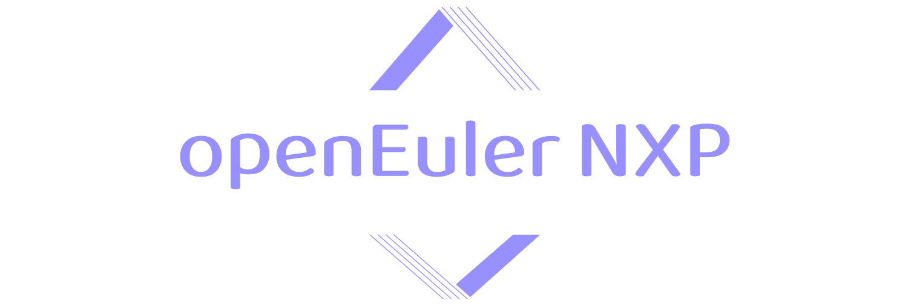
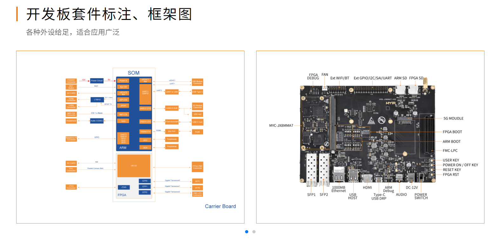
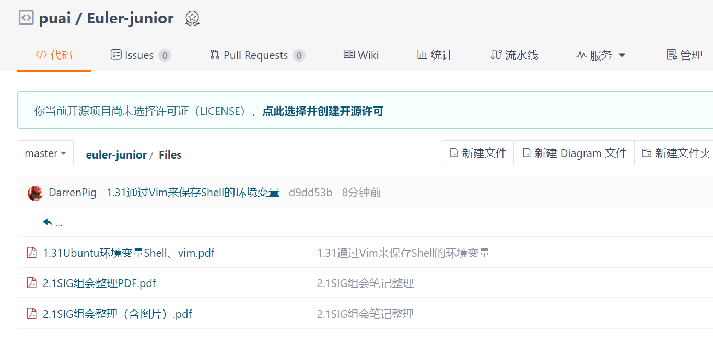

# Euler-junior_NXP

## openEluer Embedded BSP[雪球计划](https://gitee.com/openeuler/yocto-meta-openeuler/issues/I90DOU#comment-loadder)
#### 介绍

> 旨在对南向BSP的覆盖活动，目的是扩大openEuler对南向bsp的支持范围， “雪球计划”，寓意openEuler将一步步强大，最终成为国内乃至国际顶流嵌入式操作系统

 ### **本小组研究：NXP** 
| SOC型号 | soc厂商 | bsp型号 | 赞助商 | gitee id | 进度 | 完成时间 | 备注 |
|-------|-------|-------|-----|----------|----|------|----|
|i.MX 6ULL|NXP|MYD-Y6ULY2-V2-4E512D-50-I|米尔科技|@DarrenPig,@puai,@wei-app | | | |
|i.MX 8M Plus|NXP|MYD-JX8MPQ-8E2D-160-I|米尔科技|puai | | | |


## 项目要求
### 1.软件能合入master
### 2.基本镜像要能运行                                                                            


## 项目成员：  @puai 、@wei-app  、@DarrenPig 


## 项目进程：

- 1.30    ✅建立群聊
- 2.1     ✅sig组会议，创建仓库
- 2.4     ✅填写报名表

##  资料共享：

- [openEuler Embedded在线文档](https://openeuler.gitee.io/yocto-meta-openeuler/master/introduction/index.html)
- [SIG的双周议题](https://etherpad.openeuler.org/p/sig-Yocto-meetings)
- [2.1组会笔记](https://gitee.com/pai_666/euler-junior/tree/master/Files)
- [MYS-6ulx-io产品手册](https://www.myir-tech.com/down/manual/NXP/MYS-6ulx-iot_product_manual.pdf)
- [MYD-JX8MMA7产品介绍](https://www.myir-tech.com/public/files/MYD-JX8MMA7%E4%BA%A7%E5%93%81%E4%BB%8B%E7%BB%8D-V1.0.pdf)
### 个人进度

#### DarrenPig
- 1.29 ✅ubuntu 的镜像[ubuntu-22.04.3-desktop-amd64] VMware 安装, [shell环境学习](https://blog.csdn.net/cnds123/article/details/107427030)
- 1.30 ✅啃 yocto 的文档，本地部署[~/.bashrc-Linux环境变量](https://zhuanlan.zhihu.com/p/359354934)（Day 1）
- 1.31 ✅bitbake、[vim](https://www.runoob.com/linux/linux-vim.html)、poky（Day 2）
- 2.1   ✅[Yocto部署笔记](https://gitee.com/pai_666/euler-junior/blob/master/Files/1.31Ubuntu%E7%8E%AF%E5%A2%83%E5%8F%98%E9%87%8FShell%E3%80%81vim.pdf)、sig组会（Day 3）
- 2.3   ✅code、❌SSH到Ubuntu环境
- 2.4   ✅[报名表](https://gitee.com/openeuler/yocto-meta-openeuler/issues/I90DOU#comment-loadder)、Yocto文档到构建
- 2.5   ❌继续啃文档，✅在网上冲浪


##### ✅目标：本周六`2.3`之前完成Yocto部署


##### -[🙂]  SSH隧穿VM上的Ubuntu的Shell会不会更方便一些？
##### -[🙂]  蹲2、3月份的南京MeetUP  
##### -[👌]  文档是不是直接看官网就好？ 
##### -[👌]  用openSSH连接会不会好一些?
##### -[👌]  docker是啥概念？
##### -[🫥]  在docker里编译树莓派？
##### -[🫥]  yocto的脚本使用？
##### -[🫥]  怎么拉内核代码？
##### -[🫥]  怎么打patch？
##### -[🫥]  WLS2的环境好用，还是VM里好用？
##### -[🫥]  imx资料要看吗？

#### ✅大家可以在这补充...


---
## 最近活动：2.1SIG组会
有关摘要：

 **openEuler/yocto-meta-openEuler
双周例会：** 
### 一、近期进展
- isula —→ systemd解耦
			—→ host OS / 容器OS
					（容器相关的生态需求支持）
- openEuler —→ 以前——包dnf——数据源不同源 → 服务器端的数据
- 希望未来以image镜像为载体～容器为载体|通过rpm包更多向image发展
- oe-build——>图形化选择
- bsp雪球计划
### 二、isula基本使用
Embedded —→ OSI容器引擎
				—→ CLI、CRI管理操作接口
- oe-build构建标准镜像
- isula容器引擎
#Step 1
- NAT模式	网桥（默认网关）
- 虚拟机OS（局域网）
......

### 三、【重点】 **雪球计划 南向bsp**  支持范围（bsp-都有环境 —→ yocto）
Soc支持， **[米尔科技](https://www.myir-tech.com%2Fproduct%2Findex.asp%3Fanclassid%3D100)** 赞助：选择硬件板子 —→ issues统计Gitee ID
- → 可以传递）
-  **雪球计划 → 预计持续到5月** 
## 项目要求：
### - 合入  master  主线 —→ 代码
### - 基本镜像可以运行 —→ 硬件

- [ ] 版本，内核（不一定统一的要求下）—→ 先满足上述两个要求。


## 维护日志：2.1 @DarrenPig Readme、两份笔记(vim环境变量、2.1组会笔记)
## 维护日志：2.4 @DarrenPig Readme 报名信息
✅ ✅ ❌

---

## P.S.:好玩的文档
社区文档（sphinx）怎么编译

```
sudo apt-get install python3-sphinx
pip3 install sphinx_rtd_theme sphinx_multiversion sphinx_tabs -i https://pypi.tuna.tsinghua.edu.cn/simple
```
装上sphinx环境，去拉社区文档仓（docs），就可以make html，生成文档了
> 1.30 @puai 社区文档的用法

## 24.03这个版本我们贡献扎实点，未来6年都这个版本！
> 1.30 @puai 大体进展是24.03开始