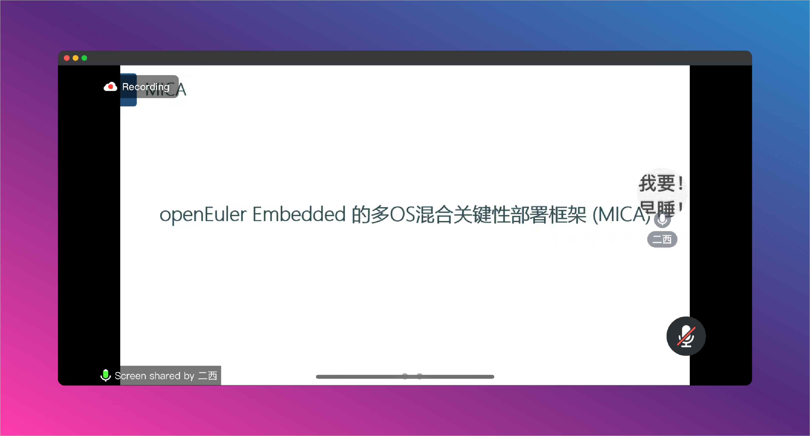

# Euler-junior_NXP

## openEluer Embedded BSP[雪球计划](https://gitee.com/openeuler/yocto-meta-openeuler/issues/I90DOU#comment-loadder)
#### 介绍

> 旨在对南向BSP的覆盖活动，目的是扩大openEuler对南向bsp的支持范围， “雪球计划”，寓意openEuler将一步步强大，最终成为国内乃至国际顶流嵌入式操作系统
### BSP开发步骤参考如下:


> 1. 开发板资料学习,了解机器特性,以及使用,测试,烧录方法,
> 验收标准:开发板特性、开发烧录、测试文档
> 
> 2. 使用开发板资料的SDK进行构建,做烧录测试,了解其目录结构,所使用的工具,代码、固件存放位置等,厂商linux kernel如果能选择,尽量使用内核为5.x版本作为参照对象
> 验收标准:开发板特性对应的代码目录结构解析
> 
> 3. 内核移植:下载openeuler-kernel源码,从社区节点embedded-openeuler中进行提取版本号,并下载
> 例如从master开发,查看https://gitee.com/openeuler/yocto-meta-openeuler/blob/master/.oebuild/manifest.yaml 中 kernel 的tag并下载
> 代码如下:
> kernel-5.10:
> 
> remote_url: https://gitee.com/openeuler/kernel.git
> 
> version: 673b97e8053120a4b56fe5b5d5748dcef68a3f50
> 
> a. 下载源码到本地:
> ​ git clone https://gitee.com/openeuler/kernel.git openeuler-kernel -b openEuler-22.03-LTS-SP2
> ​ cd openeuler-kernel
> 
> ​ git checkout 673b97e8053120a4b56fe5b5d5748dcef68a3f50
> 
> ​ 下一步就是驱动移植及验证
> ​ b. 从设备树查看外设驱动是否存在设备树中对应节点有compitible属性,在driver里面查找对应的驱动,如果则尝试编译其deconfig,如果没有的话就从厂商提供
> 的SDK中移植到openeuler-kernel,并完成驱动debug
> 验收标准:移植完成的内核推送到对应的PR上,并完善文档,外设支持的内容。以及通过的验证方法。
> 4. 内核移植验证完成后制作yocto-meta-openeuler的BSP层
> a. 引入上游的BSP层以及软件层
> i. 初始化环境:
> 1) oebuild init <init_dir> -u <your_own_repo_url>
> 2) oebuild update
> 如果上游有BSP层:
> ii. 复制一份.oebuild/platform/里面的板平台为这次需要的machine,并修改内容为上游层的repo_url以及layer。
> 
> iii. 制作完以上文件即可使用oebuild generate -p <machine>,并按指示进入容器
> iv. 制作openeuler的适配的附加层:
> 1) 参考bsp/meta-openeuler-bsp/raspberrypi,在同级目录下新建一个目录vender名字的目录
> 2) 在上述目录下增加三个基础核心配方集
> a) recipes-bsp:存放基础的配方以及固件如uboot/grub/bootfiles等
> b) recipes-core:主要存放images/packagegroups/systemd等系统核心部分
> c) recipes-kernel:主要存放linux等欧拉内核相关配方
> 3) 在bsp/meta-openeuler-bsp/conf/layer.conf中参考raspberrypi与rockchip内容,增加自己的附加层
> v. 在bsp下制作BSP层,也可以直接复制meta-hisilicon,并修改成自己要样子。也可以参考yocto文档从bitbake构建bsp层

https://docs.yoctoproject.org/bsp-guide/bsp.html#creating-a-new-bsp-layer-using-the-bitbake-layers-script


## 项目要求
### 1.软件能合入master
### 2.基本镜像要能运行                                                                            


## 项目成员：  @puai 、@wei-app  、@DarrenPig 


## 项目进程：

- 1.30    ✅建立群聊
- 2.1     ✅sig组会议，创建仓库
- 2.4     ✅填写报名表
- 2.22    ✅收到imx8开发板, MYD-JX8MX(@DarrenPig )
- 2.23    ✅都在看文档
- 3.26    ❌29号前看一下BSP源码
- 4.10    ✅加紧进度，开会交流
- 5.30    ✅继续看编译环境，修改uboot
##  资料共享：

- [openEuler Embedded在线文档【社区文档】](https://openeuler.gitee.io/yocto-meta-openeuler/master/introduction/index.html)
- [SIG的双周议题](https://etherpad.openeuler.org/p/sig-Yocto-meetings)
- [2.1组会笔记](https://gitee.com/pai_666/euler-junior/tree/master/Files)
- [MYS-6ulx-io产品手册](https://www.myir-tech.com/down/manual/NXP/MYS-6ulx-iot_product_manual.pdf)
- [MYD-JX8MMA7产品介绍](https://www.myir-tech.com/public/files/MYD-JX8MMA7%E4%BA%A7%E5%93%81%E4%BB%8B%E7%BB%8D-V1.0.pdf)
- [imx8产品 手册、引脚定义、GPIO](http://mier.sz2.hostadm.net/upload/files/product/20230915/16947497869753189.pdf)
- [NXP的imx8芯片手册  i.MX 8M Mini Applications Processor Datasheet for Industrial Products](https://www.nxp.com.cn/docs/en/data-sheet/IMX8MMIEC.pdf)
- [【NXP官网】imx8的芯片介绍，详细内容](https://www.nxp.com/products/processors-and-microcontrollers/arm-processors/i-mx-applications-processors/i-mx-8-applications-processors/i-mx-8m-family-armcortex-a53-cortex-m4-audio-voice-video:i.MX8M?lang=en&lang_cd=en&)
- [【NXP官方】datesheet](https://www.nxp.com/docs/en/data-sheet/IMX8MDQLQIEC.pdf)
- [【Sig_B站21年录屏】yocto 技术分享第一期：yocto 构建系统之前世今生](https://www.bilibili.com/video/BV1WT4y1R7sK/?)
- [【学习资料-B站韦山东NXP】基于100ASK_IMX6ULL开发板的lvgl学习+开发教程](http://download.100ask.net/boards/Nxp/100ask_imx6ull_pro/index.html
)
- [【韦东山】韦东山手把手教你嵌入式Linux快速入门到精通 | Linux应用驱动开发基于I.MX6U](https://www.bilibili.com/video/BV1w4411B7a4/?)

- [❌MYD-JX8MX 资源下载【米尔科技官方】(下面已贴)](http://down.myir-tech.com/MYD-JX8MX/)
#### [MYD-JX8MPQ-L5.10.9-V2.0.0.【米尔科技官方】](https://down.myir-tech.com/MYD-JX8MP/)
### 米尔的仓库：https://github.com/MYiR-Dev/myir-imx-manifest/tree/i.MX8M-5.10-hardknott
### 个人进度

#### DarrenPig
- 1.29  ✅ubuntu 的镜像[ubuntu-22.04.3-desktop-amd64] VMware 安装, [shell环境学习](https://blog.csdn.net/cnds123/article/details/107427030)
- 1.30  ✅啃 yocto 的文档，本地部署[~/.bashrc-Linux环境变量](https://zhuanlan.zhihu.com/p/359354934)（Day 1）
- 1.31  ✅bitbake、[vim](https://www.runoob.com/linux/linux-vim.html)、poky（Day 2）
- 2.1   ✅[Yocto部署笔记](https://gitee.com/pai_666/euler-junior/blob/master/Files/1.31Ubuntu%E7%8E%AF%E5%A2%83%E5%8F%98%E9%87%8FShell%E3%80%81vim.pdf)、sig组会（Day 3）
- 2.3   ✅code、❌SSH到Ubuntu环境
- 2.4   ✅[报名表](https://gitee.com/openeuler/yocto-meta-openeuler/issues/I90DOU#comment-loadder)、Yocto文档到构建
- 2.5   ❌继续啃文档，✅在网上冲浪
- ......(春节)
- 2.21  ✅开始 imx8 的移植， 确认具体的开发板寄送地址和型号 ❌继续啃文档 
- 2.22  ✅收到单板，开始啃NXP的[imx 8 mini手册](https://www.nxp.com.cn/docs/en/data-sheet/IMX8MMIEC.pdf)❌ 开箱、找官方的Yocto虚拟机环境
- 2.23  ✅对MYD-JX8MP的快速开始手册（QSG），啃完了，通电、串口通信搞定 ❌
- 2.27  ✅啃完米尔科技给的板子附带的文档
- 2.28  ✅开始用Myr给的环境，构建Yocto
- 3.7   ✅Github双相库，尝试上传文件包，但502网关问题
- 3.10  ✅下载镜像包，团队组会
- 3.11  ✅本周任务：4.19自己本地编译，完成镜像的烧录
- 3.14  ✅下载镜像包、板子初次上电，SD卡烧录❌直接上电烧录失败
- 3.24  ✅Try to deal with 板子附带的文档:镜像的烧录❌本地编译运行存储不足，更换本地固态硬盘为4T（米尔建议使用800G以上环境），之前的虚拟机崩溃了，快照可恢复
- 3.26  ✅本地重新在win11专业版桌面的WSL中Ubuntu20.04安装poky、imx8环境，加载环境配置，争取两天内编译好镜像❌虚拟机崩溃，转向容器方案
- 3.29  ✅Nanjing MeetUp 关于星闪、欧拉派
- 4.1   ✅本地wsl环境搭建，22.04无法编译米尔的源文件
- 4.2   ✅更换Ubuntu18，编译源文件
- 4.21  ✅啃完新的手册（2周），重新本地编译
- 4.22  ❌本地环境重新下，出现问题
- 4.23  ❌还是报错:环境WSL：Apr 24 00:22:40 DArren systemd[1]: Failed to start Samba NMB Daemon.  端口号299、450 已暴露，但399无反应
- 4.25  ✅解决问题，wsl环境可以直接用
- 4.27  ✅编译SDK
- 5.20  ❌.wic烧录报错
- 5.25  ❌环境变量bitbake无法加载
- 5.27  ✅重新构建解压，编译环境
- 5.30  ✅fectch 环境，代理
- 5.31  ✅重新 bitbake full image，重新编译uboot
- 6.3   ✅修改bitbake文件，完成相关的路径修改
- 6.4   ✅bitbake miyr-full-image进行编译❌卡在48%

###### - 4.3   ✅上传文件包——User_Manual、NXP_Manual（使用[Github同步仓](https://github.com/Darrenpig/Yocto_tutorial)，[git lfs](https://github.com/git-lfs/git-lfs?tab=readme-ov-file) track上传大于50MBPDF文件）


https://github.com/git-lfs/git-lfs?tab=readme-ov-file
##### ✅目标：本周六`2.3`之前完成 Yocto 部署
##### ✅目标：本周三`2.21`之前完成 imx 8 软件包部署
##### ✅目标：本周五`4.11`之前上传上电加载的内容


 -[🙂]  SSH隧穿VM上的Ubuntu的Shell会不会更方便一些？
 -[🙂]  蹲2、3月份的南京MeetUP  
 -[🙂]  WLS2的环境好用，还是VM里好用？
 -[🙂]  imx资料要看吗？
 -[🙂]  文档是不是直接看官网就好？ 
 -[🙂]  用openSSH连接会不会好一些?
 -[🙂]  docker是啥概念？
 -[🙂]  3月中旬的南京MeetUp我啥时候去呢？

##### -[🫥]  在docker里编译树莓派？
##### -[🫥]  yocto的脚本使用？
##### -[🫥]  怎么拉内核代码？
##### -[🫥]  怎么打patch？
-[🙂]  yocto里集成一个第三方软件源码
-[🙂]  b站有个韦东山讲nxp的视频_我把链接附上面了
-[🙂]  开工了，开工了
-[🙂]  开学了，开学了
##### -[🫥]  周五，左右我会搞定本地环境的搭建
##### -[🫥]  Gitub CLI好像传不了1.6G的imx-linux
##### -[🫥]  本地安装编译环境，测试SD卡上电
##### -[🫥]  硬盘满了，换了个4T的，正在重新安装虚拟机环境
#### -[🙂] 超过50MB的文件无法上传Gitee社区版，使用Github的lfs打包上传文件
#### -[🙂] 无法fectch: nxp-demo-experience \ 已挂代理
#### -[🙂] nxp-demo-experience \,在imx-image-multimedia.bb中注释了，重新编译
#### -[🙂] 已经可以bitbake编译了，我们准备开始做内核移植了

###  imx8（MYD-JX8MP）资料己经贴下面了【百度网盘(80G左右)】，部分文档已经上传本仓库和群

#### ✅大家可以在这补充...

---
#### imx 8 的文件：【下载这个：@Weiwei】https://down.myir-tech.com/MYD-JX8MP/

### MYD-JX8MPQ 资源包
> 适用于米尔电子的MYD-JX8MPQ系列核心板和开发板。其中包括米尔定制的底层BSP源码、预编译的镜像文件、Linux软件评估和开发相关的文档、以及开发调试过程中使用的一些工具等。
- 原产品DDR大小是3G，目前新增2G DDR/4G DDR配置，最新BSP V2.0.0-L5.10.9
#### 文档下载
##### MYD-JX8MPQ文档 MYD-JX8MPQ软硬件手册，包含电路图，PIN脚定义，数据手册，开发手册,3D结构等
#### 镜像下载
###### 02_Image_8E2D 2G DDR 全面型系统镜像，包含丰富的linux命令集，QT5.15.0运行库，python3组件
###### 02_Image_8E3D 3G DDR 全面型系统镜像，包含丰富的linux命令集，QT5.15.0运行库，python3组件 --【编译会 DDR 报错】
###### 02_Image_8E4D 4G DDR 全面型系统镜像，包含丰富的linux命令集，QT5.15.0运行库，python3组件

>  版本号	状态	发布时间	镜像 v2.0.0	GA	2022-11-07	MYD-JX8MPQ-L5.10.9-V2.0.0.iso


### 系统镜像 System Binary Image 【这是我们的任务】

构建流程图



---
## 最近活动：

### 5.30 SIG例会 ，目前已有相当数量的image提交，24.03的版本发布将会预计6月中旬发布

### 我们的NXP如果要赶上，最近要加急了。其中大部分将会在6月初（6月15日左右准备好文档的提交）

 2.29SIG例会记录——>年后第一场   -->    5.30最近一次SIG例会
##### 一、MICA

实时操作系统，多底座。统一接口的共享内存。

使用的方式：文档MICA，使用QEMU部署、RTOS部署等

## 二、近期环节

```mermaid 
graph TB  
    Meeting412["4.12小组会议"]  
    ErrorFound["发现资料包提供错误"]  
    Version510["已有5.10版本适配"]  
    SIGMeeting530["5.30 SIG例会"]  
    G11MeetUp["2.23-25 成都 G11 MeetUp"]  
    EmbeddedSigMeetup["4.2 南京南邮Embedded-Sig MeetUp"]  
    OulaPaiXingShan["欧拉派、星闪"]  
    KunpengDevCon["5.10 Kunpeng开发者大会"]
    Meeting412 --> ErrorFound  
    ErrorFound --> Version510  
    SIGMeeting530 --> Version510
    G11MeetUp --> IntlInfoSniff  
    EmbeddedSigMeetup --> OulaPaiXingShan  
    KunpengDevCon --> Version510
    style Version510 fill:#f9f,stroke:#333,stroke-width:2px  
    style SIGMeeting530 fill:#ccf,stroke:#333,stroke-width:2px  
    style KunpengDevCon fill:#ccf,stroke:#333,stroke-width:2px  
    linkStyle 0 stroke-dasharray: 5, 5  
    linkStyle 1 stroke-dasharray: 5, 5  
    linkStyle 2 stroke-dasharray: 5, 5

```

### 4.12小组会议，发现资料包提供错误，并且已有5.10相关的版本适配。
### 5.30 SIG例会 ，目前已有
### 2.23-25 成都 G11 MeetUp 
国际化、信息嗅探
### 4.2 南京南邮Embedded-Sig MeetUp  
欧拉派、星闪
### 5.10 Kunpeng开发者大会

---

# 三、要求项目跟进【周末我来看看】

### SDK资料\熟悉、了解、板子的内核迁移

NXP、大部分都在Linux_openEuler里有驱动

## 按设备树驱动移植

### 切换内核、驱动移植、验证、Debug

### Yocto引入BSP层，按树莓派、瑞星微，引入官方的层，代码欧拉化

## 驱动、引进  注意 NXP 里 的软件层

### 官方的资料的文档......欧拉的文档要相应的跟进

> 提交欧拉的板块、最小系统的拉起、官方地方特定工程
> 内核参考、如果内核成熟可以简略
## [fork 主仓参考 提交PR上去]，NXP 我们的进度，参考树莓派、海鸥派文档风格
---
2.1SIG组会
有关摘要：
......
###  **雪球计划 南向bsp**  支持范围（bsp-都有环境 —→ yocto）
Soc支持， **[米尔科技](https://www.myir-tech.com%2Fproduct%2Findex.asp%3Fanclassid%3D100)** 赞助：选择硬件板子 —→ issues统计Gitee ID
- → 可以传递）
-  **雪球计划 → 预计持续到5月** 
## 项目要求：
### - 合入  master  主线 —→ 代码
### - 基本镜像可以运行 —→ 硬件
- [ ] 版本，内核（不一定统一的要求下）—→ 先满足上述两个要求。
---
### 维护信息

#### 维护日志: 2.01 @DarrenPig Readme、两份笔记(vim环境变量、2.1组会笔记)
#### 维护日志: 2.04 @DarrenPig Readme 报名信息
#### 维护日志: 2.21 @DarrenPig Readme 开发板寄送信息，开工计划
#### 维护日志: 2.22 @DarrenPig Readme 开发板开箱，更新imx8寄送收单上的文档
#### 维护日志: 2.23 @DarrenPig Readme 开发板 韦山东imx6_NXP相关内容链接 3份PDF上传File
#### 维护日志: 2.28 @DarrenPig Readme 个人进度、上传了IMX6、IMX8的文件到仓库里
#### 维护日志: 3.03 @DarrenPig Readme 2.29年后例会的一些记录，关于要求和项目跟进之类的
#### 维护日志: 3.14 @DarrenPig Readme 周日组会的简要记录，个人进度。
#### 维护日志: 3.24 @DarrenPig Readme 成都 G11&Doc Sig 的 MeetUp, 更新一些相关的内容
#### 维护日志: 3.26 @DarrenPig Readme 去南京 MeetUp 前看 BSP 的小组短期计划，更新个人进度
#### 维护日志: 4.03 @DarrenPig Readme 上传User_Manual、NXP_Manual，本地wsl在18上编译
#### 维护日志: 4.16 @DarrenPig Readme 更改MY的资料包，https://github.com/Darrenpig/myir-imx-linux 本地fork了一份到Gitee
#### 维护日志: 4.26 @DarrenPig Readme SIG双周例会，24.03版本发布特性，提问解决Samba和WSL的Yocoto编译问题
#### 维护日志: 4.28 @DarrenPig Readme 解决Samba报错以及SDK在WSL中的烧录
#### 维护日志: 5.12 @DarrenPig Readme 几场 MeetUp、峰会的整理笔记
#### 维护日志: 5.30 @DarrenPig Readme 近期进展。雪球计划群里提问，解决fecth报错
#### 维护日志: 5.31 @DarrenPig Readme 单独编译uboot 
#### 维护日志: 6.04 @DarrenPig Readme 顺利执行 bitbake miyr-full-image 编译SDK，解决48%。其他仍在编译中
✅ ✅ ❌

---

## P.S.:好玩的文档
社区文档（sphinx）怎么编译
```
sudo apt-get install python3-sphinx
pip3 install sphinx_rtd_theme sphinx_multiversion sphinx_tabs -i https://pypi.tuna.tsinghua.edu.cn/simple
```
装上sphinx环境，去拉社区文档仓（docs），就可以make html，生成文档了
> 1.30 @puai 社区文档的用法

## 24.03这个版本我们贡献扎实点，未来6年都这个版本！
> 1.30 @puai 大体进展是24.03开始

  @DarrenPig 记得3月中旬报名去南邮——MeetUp（imx8我尽量给点力）
> 2.21 @puai  @DarrenPig要开始做imx8了（imx6 被抢了）

#####  @wei-app 看一下 NXP 的 单板附带的质量链接 
> 2.22 @DarrenPig 你要的贴上去了——资料共享那

##### 今天研究一天，我明天在家也研究，下周一我们让李**给我们说说，看方向偏没有
> 2.23 @puai 这两天任务

##### 今天维护一下Readme，现在openEuler Embedded 都是5.10版本了
> 2.27 @puai明天我们定个会。
##### [fork 主仓参考 提交PR上去]，NXP我们的进度，参考树莓派文档风格
> 2.29 @DarrenPig 组会要求我们，在主仓跟进一下进度的doc,划分了四步
#### 我们先跑一遍4.19。一周时间，4.19先上去、文件、uboot、内核、环境变量...
> 3.14 @puai 20日前，5.10编起来
#### @DarrenPig  @wei-app 本周抽点时间把nxp的bsp一起看一下
> 3.26 @puai 昨天领导让我去南京，我说我要学习
#### @DarrenPig 空了一起看看 nxp的那个问题哇
> 4.3 @wei-app 单板的几个手册能不能上到gitee上
#### @DarrenPig 例会、个人进展我跟新上来了
> 4.10 @puai 明天约个会。看看当前的进展
#### @DarrenPig 米尔的子资料已经更新了，新的我今晚编译一下
> 4.15 @wei-app 你编译出来了吗？
#### @DarrenPig 周六晚上要开会
> 4.19 我今晚编译一下
#### @DarrenPig SDK 编译成功4.28
> 4.27 Samba在WSL中不用使用
### Fetcher faiture for,URu...
> 5.5 @DarrenPig BB NO NETWORk "1"本地编译试一下
### Kunpeng开发者大会·北京 , 欧拉派Hi-Euler, 昇思LSTM, MindFormers Ai模型
> 5.9 @puai @DarrenPig 交流学习 Devkit, Euler Copilot, Ascend 昇腾CANN, 香橙派Aipro
##### 最近大家没声音了？都很忙哇？
> 5.16 @puai 我们是不是开发版的镜像还没编出来
## @DarrenPig bitbake 已经可以编译SDK和镜像了
> 6.1 请问在bb文件编译的时候PWD路径要换成具体路径吗(改了3个文件conf.bb\.bashrc\nxp-demo-experience_1.0.bb解决了)
